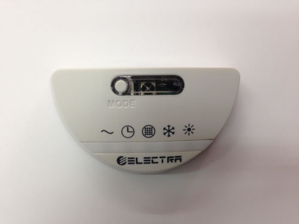
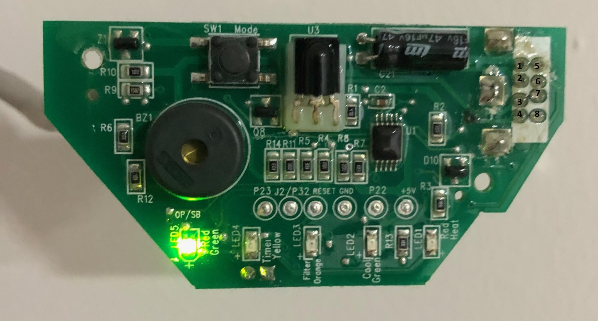
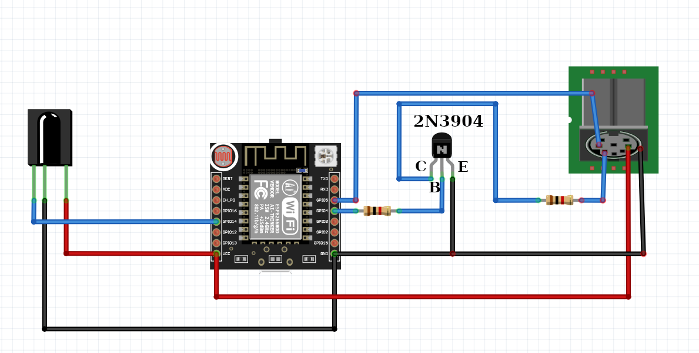
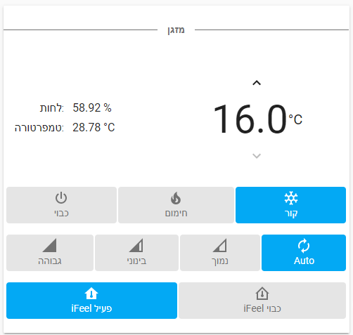

# ElectraWifi
This project intends to replace a plain Electra AC IR receiver with an ESP8266 to give it wifi capabilities and control it over MQTT.

## Description


The original receiver itself is "dumb" and doesn't hold any state and all the interaction is handled by the main unit, this makes it expandable so it can easily be replaced by an ESP8266.

The receiver is connected to the main unit with an 8-pin mini din connector, with the following pins:

1. 5V
2. Heat LED
3. IR signal
4. Green power LED (LOW for on)
5. Timer LED
6. Beep
7. Button
8. Cool LED

So now all we need to do is throw out the old receiver and hook up an ESP8266 to the pins 1, 3, 4.

## Prerequisites
### Hardware
First you would need:
- ESP8266 (ESP32 would also work)
- 1 NPN transistor
- 2 1kΩ resistors
- A breadboard/PCB
- IR receiver (optional)

Hook everything up according to the following schematic:


To use the code as-is, use GPIO4 for IR send, GPIO5 for power state input and GPIO14 for IR recv (optional).

### Software
The code in this repo is based on [Homie](https://github.com/homieiot/homie-esp8266) for MQTT handling and for OTA.
Please follow the instructions there to install all the dependencies.

Once the code is installed on the esp, it will boot in configuration mode. Follow the instructions [here](https://homieiot.github.io/homie-esp8266/docs/2.0.0/configuration/json-configuration-file/) to upload a JSON configuration file.

### Building
Building with platform.io is quite simple. But Homie is not compatible with Platform.io 3.0 for ESP8266 out of the box. You need to change two files in the Homie library.
- Start building as usual. You will see some errors regarding the "HTTPClient" calls not being supported.
- Navigate to the ./pio/libdeps/<target>/Homie/src/Homie/Boot
- Edit the `BootConfig.hpp` and `BootConfig.cpp` files as follows:

- BootConfig.hpp
Add the following line:
```
  WiFiClient _wifiClient;
```
So that the file looks as follows:
```
 private:
  AsyncWebServer _http;
  WiFiClient _wifiClient;
  HTTPClient _httpClient;
  DNSServer _dns;
```

- BootConfig.cpp
Replace the following line:
```
  _httpClient.begin(url);
```
so that it looks as follows:
```
  // send request to destination (as in incoming host header)
  _httpClient.setUserAgent(F("ESP8266-Homie"));
  _httpClient.begin(_wifiClient,url);
  // copy headers
```


## Usage
After the esp is configured, it will subscribe to the following MQTT topics:
- .../state/json/set 
  - This topic accepts a json in the following format (all fields are mandatory), updates the state and send it to the AC unit:   
  `{"power": "on|off", "mode": "cool|heat|fan|dry|auto", "fan": "low|med|high|auto", "temperature": 15..30, "ifeel": "on|off", "swing":"on|off|hor|both"}`
- .../ifeel_temperature/state/set
  - This topic accepts a number between 5 and 36 and sends it to the main unit as a temperature received by the "i feel" function of the remote.
  
Monitoring and getting the real state of the AC is also possible by subscribing to the following topics:
- .../power/state
- .../mode/state
- .../fan/state
- .../temperature/state
- .../ifeel/state
- .../swing/state

### Home Assistant

Home Assistant's MQTT HVAC component can be used with the following configuration:

```yaml
climate:
  - platform: mqtt
    name: AC
    modes:
      - "heat"
      - "cool"
      - "dry"
      - "off"
    fan_modes:
      - "high"
      - "med"
      - "low"
      - "auto"
    swing_modes:
      - "off"
      - "on"
      - "hor"
      - "both"
    min_temp: 16
    max_temp: 30
    power_command_topic: "devices/AC/power/state/set"
    payload_on: "on"
    payload_off: "off"
    mode_command_topic: "devices/AC/mode/state/set"
    mode_state_topic: "devices/AC/mode/state"
    temperature_command_topic: "devices/AC/temperature/state/set"
    temperature_state_topic: "devices/AC/temperature/state"
    fan_mode_command_topic: "devices/AC/fan/state/set"
    fan_mode_state_topic: "devices/AC/fan/state"
    swing_mode_command_topic: "devices/AC/swing/state/set"
    swing_mode_state_topic: "devices/AC/swing/state"
```

It's possible to activate the iFeel by using the build-in aux-heat or away_mode topic for the MQTT HVAC component by adding the following lines:
Its not ideal as it will show "Preset: Home/Away" but it works fine.

```yaml
climate:
    ...
    ...
    away_mode_command_topic: "devices/AC/ifeel/state/set"
    away_mode_state_topic: "devices/AC/ifeel/state"
```

### Home Assistant - Lovelace UI

Lovelace UI example:



Home Assistant's MQTT HVAC component can be used with the following configuration (note the use if simple-thermostat custom component):

```yaml
cards:
  - type: custom:simple-thermostat
    entity: climate.ac
    name: false
    step_size: 1
    control:
      _headings: false
      hvac:
        'off':
          icon: mdi:power
          name: 'כבוי'
        cool:
          icon: mdi:snowflake
          name: 'קור'
        heat:
          icon: mdi:fire
          name: 'חימום'
        dry: false
      fan:
        'low':
          icon: mdi:network-strength-1
          name: 'נמוך'
        'med':
          icon: mdi:network-strength-3
          name: 'בינוני'
        'high':
          icon: mdi:network-strength-4
          name: 'גבוהה'
        'Auto':
          icon: mdi:autorenew
          name: 'אוטו'
      swing:
        'on':
          icon: mdi:home-thermometer
          name: 'iFeel פעיל'
        'off':
          icon: mdi:home-thermometer-outline
          name: 'iFeel כבוי'
    sensors:
      - entity: sensor.<external-hunidity-sensor>
        name: 'לחות'
      - entity: sensor.<external-temperature-sensor>
        name: 'טמפרטורה'
    hide:
      mode: false
      temperature: true
```

### Home Assistant - iFeel update based to external sensor

To Inject external temperature (from any tempureture sensor) to iFeel every minute, add the following automation:

```yaml
automation:
  - alias: Update ifeel temperature
    initial_state: 'on'
    trigger:
      platform: time_pattern
      minutes: "/1"
    action:
      service: mqtt.publish
      data:
        topic: "homie/<homie-id>/ifeel_temperature/state/set"
        payload_template: "{{ states.sensor.<my-tempereture-sensor>.state }}"
```

### Credits

Many thanks to @barakwei and [IRelectra](https://github.com/barakwei/IRelectra) for analyzing the IR protocol.
